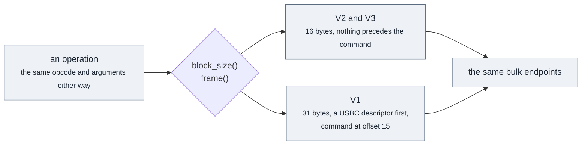

# Architecture

The library is a stack of layers, and the whole design rests on one rule: each layer talks
only downward, and is forbidden from knowing what the layer above it is doing. Most of the
decisions in the codebase follow from that, and the ones that look odd usually look odd
because they are protecting it.

## The layers, and what each is not allowed to know

**ITransport** moves bytes and knows nothing about debugging. It does not know whether the
bytes it carries are a command, a reply or trace output; it has three named channels and moves
bytes on them. It particularly does not know what an ST-LINK is. The channels are named rather
than numbered because an endpoint number is a USB idea, and letting one appear in the
interface would put USB into every layer above.

**CommandChannel** knows that a command goes out and a reply comes back, and that the first
byte of a reply usually says whether the programmer could do what was asked. It knows nothing
about opcodes. It cannot tell you what command it just carried.

**IProgrammer** knows opcodes, command blocks and firmware quirks. This is where the
generations differ, and it is the only place they differ. It knows nothing about STM32s: it
will read four bytes from an address for you without any opinion about what lives there.

**IDevice** knows that there is a chip on the other side, what that chip is, and where its
memories are. It is the first layer that has ever heard of a flash family.

**IFlash** knows how one family's flash controller is driven. Nothing else in the library
does, which is why adding a family is additive rather than invasive.

Only `IDevice` and `IFlash` are public. A caller never sees a probe, an opcode or an endpoint.

## Why the V1 is not a transport

An ST-LINK/V1 presents itself to the operating system as a USB mass storage device, and its
commands travel inside SCSI command descriptors. The obvious reading is that it needs a
different transport, and that reading is wrong: the SCSI blocks go over the same bulk
endpoints as everything else. The framing is a property of the command set, not of the wire.

So a V1 is a programmer that frames its commands differently, and `ProgrammerBase` provides
exactly one seam for it: `block_size()` says how long a command block is, and `frame()` writes
whatever precedes the command and returns the offset the command goes at.

No opcode anywhere knows this is happening, and neither does the transport: both framings
travel over the same two bulk endpoints.

## Where the generations actually differ

Less than the C project's three-way branches suggest. A V3 speaks the V2 command set: every
one of those branches hands V2 and V3 the same opcode. What genuinely differs is how much a
V3 carries, 512 bytes to an unaligned write rather than 64 and an 8 KB trace buffer rather
than 2 KB, and that its clock rates are read from the device rather than looked up, because
what a V3 can drive depends on how it is itself clocked.

That is why `ProgrammerV3` derives from `ProgrammerV2` and overrides three things, while
`ProgrammerV1` derives from `ProgrammerBase` and inherits no opcode it cannot speak.

The command set a programmer speaks is not the same as the generation on its label. An
ST-LINK/V1 with firmware J12 or later speaks the V2 command set. `Generation` comes from the
product id, before anything has been sent, and is needed that early because the version
command itself differs on a V3. `ProtocolApi` comes from the version reply, and is what
decides which class gets built.

## Chips are data, not code

A chip description is a file. Ninety-odd of them live in `libstlink/resources/chips/`, one per
device, plain text, one field per line. They say what a chip is, where its memories are, and
which flash family drives it.

There is no compiled-in table and no code generation. `init()` reads the directory at startup
and that is the whole of what the library knows. The consequence worth caring about: adding
support for a chip whose flash already behaves like an implemented family is a file, not a
patch, and `init(dir)` lets a caller supply their own directory entirely.

The format is documented beside the files, in `libstlink/resources/chips/README.md`.

One thing is deliberately not in those files: the flash size. A description says where the
chip keeps its own size, not what the size is, because one part number ships in several of
them. The size is read from the chip when a device is opened.

## Two kinds of platform seam

They are different and the distinction is deliberate.

`src/${OS}/` is for what genuinely differs per operating system. Only `paths.cpp` lives there
today, one implementation each for Linux, macOS and Windows, selected in CMake so that no
source file carries a preprocessor branch for it.

`src/${USB}/` is named for the library it uses rather than the system it runs on, because
several systems use the same one. `src/libusb/` serves Linux, the BSDs and macOS; `src/winusb/`
serves Windows, where WinUSB ships with the system and is what the ST driver package binds, so
a Windows build needs no third party USB library at all.

If macOS ever gets an IOKit backend it becomes `src/iokit/` and nothing else moves.

## No third party dependencies

The library links libusb on the platforms that need it and nothing else. There is no JSON
library, no logging framework, no string utility package. The chip parser is about forty lines
because the data is flat, and that is a deliberate trade against pulling in a parser.

GoogleTest is a test dependency and is fetched at configure time only when tests are switched
on, so it never reaches a released artefact and a normal build does not even read the file
that mentions it.
