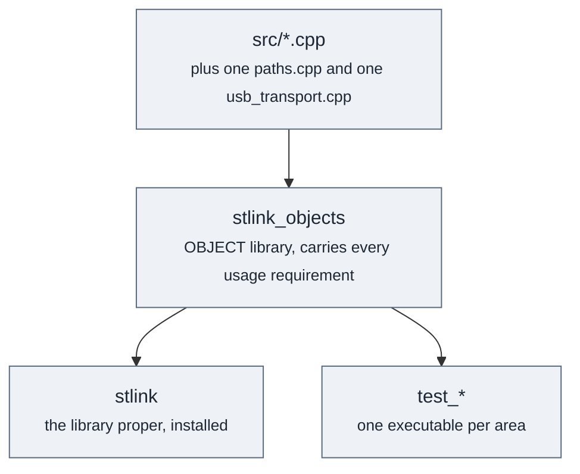

# Building

## What you need

CMake 3.16 or newer, and a compiler with C++17. On Linux, the BSDs and macOS you also need
libusb 1.0 and pkg-config; on Windows you need neither, because WinUSB ships with the system.

CI builds every commit against gcc 11 through 14, clang 14 through 18, Apple clang on macOS
14 and 15, MSVC, MinGW cross-compiled from Linux, and MinGW natively under MSYS2.

## The usual invocation

```
cmake -S . -B build -DCMAKE_BUILD_TYPE=Debug -DSTLINK_BUILD_TESTS=ON
cmake --build build -j
ctest --test-dir build --output-on-failure
```

Two options matter. `STLINK_BUILD_TESTS` defaults to off. `BUILD_SHARED_LIBS` is CMake's own
and defaults to off, so the default build is static.

Build shared at least sometimes. It is the configuration that catches a missing `STLINK_API`,
and a static-only matrix will never notice one, which is why CI builds shared on every
platform.

If libusb lives somewhere unusual, point pkg-config at it:

```
PKG_CONFIG_PATH=$HOME/somewhere/lib/pkgconfig cmake -S . -B build
```

## How the targets fit together

The sources are compiled once into an object library, and both the library and the tests are
built from those objects.



Tests link the objects rather than the library, and that is deliberate. Most of what needs
testing is internal, and hidden visibility and the absent `dllexport` are the point rather
than an obstacle. A test should not have to argue with either, and the alternative, exporting
things for the benefit of tests, would let the tests dictate the public surface.

## Tests

GoogleTest is pinned and fetched at configure time, so it brings no packaging obligation and
nothing new appears in a released artefact.

The optionality is structural rather than conditional: `STLINK_BUILD_TESTS` decides whether
`add_subdirectory(libstlink/tests)` happens at all. A default build therefore never reads the
file that mentions GoogleTest, never fetches and never clones.

`gtest_discover_tests` gives one ctest entry per `TEST()`, so a failure names the case rather
than the binary.

## What gets selected per platform

Two independent choices, both made in CMake, so no source file carries a preprocessor branch
for either.

The operating system picks `src/${STLINK_OS}/paths.cpp`, one of `windows`, `darwin` or
`linux`.

The USB backend picks `src/${STLINK_USB}/usb_transport.cpp`: `winusb` on Windows, `libusb`
everywhere else. Configure prints which one it chose.

## Where the chip descriptions go

They install to `${CMAKE_INSTALL_DATADIR}/stlink/config/chips`.

`init()` looks in three places, in order, and uses the first that exists:

1. `$STLINK_CHIPS_DIR`, if it is set
2. `../share/stlink/config/chips`, relative to the running program
3. `./chips`, beside the running program

`init(dir)` reads exactly that directory and nothing else, which is how a caller supplies
their own set. A file that cannot be read or does not parse is logged and skipped, so one bad
file does not stop the library from starting.

## Known gaps in the build

Two things a consumer will want and cannot have yet.

`find_package(stlink)` does not work. The export set is declared, but there is no
`install(EXPORT)` and no generated package config, so there is nothing for CMake to find.

Nothing in the public headers exposes a version, so a consumer cannot check what they are
compiling against.
