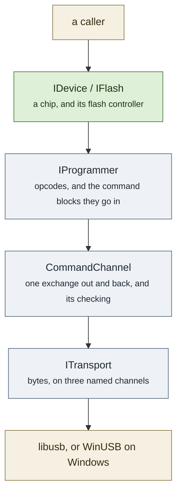

# libstlink

A library for talking to STMicroelectronics ST-LINK programmers, and through them to the STM32
on the other side.

This is a C++17 rewrite of the original C project, which is parked in `.deprecated/` while the
new one is built up underneath it. The old tree is kept verbatim so that each commit which
ports something can move it out, and the diff then shows how much is left to do.

## What it does today

The library connects to an ST-LINK, works out which generation it is, and reaches the chip
behind it. It can enumerate probes, identify the chip, read and write target memory and core
registers, and halt, run, step and reset the target.

It cannot program flash. Fifteen flash families are named across the chip descriptions and
none is implemented yet, so `IDevice::flash()` returns a placeholder that refuses everything
by name. That is the largest remaining piece of work.

## The shape of it

Five layers, each of which only talks downward, and each of which is forbidden from knowing
what the layer above it is doing.

Only the top layer is public. A caller sees devices and chips; probes, opcodes and endpoints
are the library's business. [Architecture](architecture.md) explains why the line is drawn
there and what each layer is not allowed to know.

## Where to look

[Architecture](architecture.md) is the layer stack, the platform seams, and why the chip
database is data rather than code.

[Interfaces](interfaces.md) is the four interfaces, what derives from them, and who owns whom
at runtime.

[Conventions](conventions.md) is the things that are uniform everywhere and are worth learning
once: how failure is reported, how lifetime works, what is logged, and what `STLINK_API` is
for.

[Building](building.md) is how to build it, what the options do, and how the test suite is
arranged.

The chip description file format is documented separately, beside the files themselves, in
`libstlink/resources/chips/README.md`.
