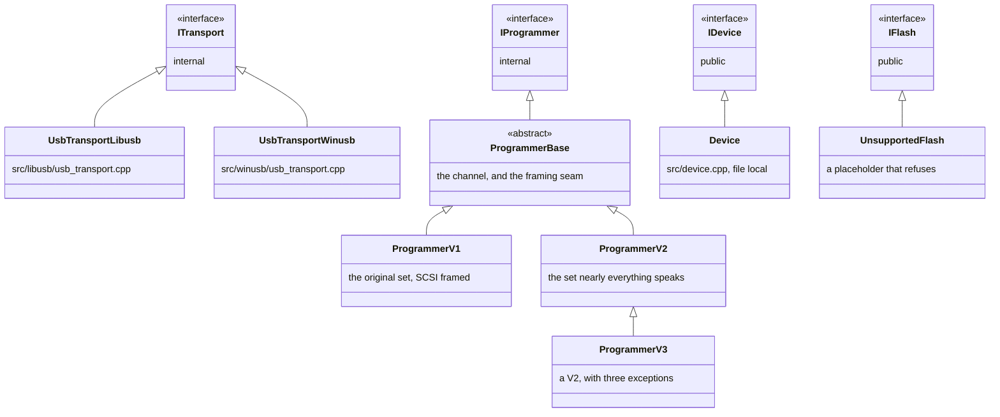

# Interfaces

Four interfaces carry the design. Two are public and two are internal, and between them they
are almost the whole of the type system worth knowing about.

## What derives from what

Both concrete USB transports are really called `UsbTransport`; they are distinguished here
only because a diagram cannot show the same name twice. They never share a build, since
exactly one of those two files is compiled, chosen in CMake.

`Device` and `UnsupportedFlash` are file local on purpose. Nothing outside `device.cpp` has
any business naming them, and a caller reaches them only as `IDevice` and `IFlash`.

## Who owns whom

Ownership is a straight line, and every link in it is exclusive.

`Device` holds a `std::unique_ptr<IProgrammer>`. `ProgrammerBase` holds a `CommandChannel` by
value. `CommandChannel` holds a `std::unique_ptr<ITransport>`. So destroying a device tears
down the whole chain in order, and there is no shared state anywhere along it.

`CommandChannel` is movable for one specific reason: the version exchange has to happen before
anyone knows which programmer class will own the connection. The channel carries that
exchange, then moves into whichever class the reply calls for, so the connection is opened
once and never reopened. The alternative was a `release()` that hands the transport back and
leaves a live but hollow channel behind, which is a worse thing to have in a codebase than a
move constructor.

## ProgrammerBase is a seam, not a base class of convenience

It implements only what can be answered without traffic, leaves everything else pure, and so
stays abstract. What it adds is `block_size()` and `frame()`, which is how a V1 wraps the
identical command in a SCSI descriptor without any opcode knowing.

No opcode appears in `programmer_base.h`, because which opcode means what is precisely what
the generations disagree about.

`CommandBlock::size()` returns the whole block rather than the part written into it. The
firmware reads a fixed number of bytes: a short block is not a short command, it is an
unrecognised one.

## IFlash is where the families will live

`IFlash` is the one interface expected to have many implementations, because flash is where
the families actually differ. Memory access and core control are uniform programmer commands;
driving a flash controller is not.

Option bytes and OTP are on `IFlash` rather than in a component of their own, because they are
the same controller. They go through the same busy wait, the same error register and the same
lock, differing only in which key unlocks it.

Today there is exactly one implementation and it refuses everything with `NotSupported`.
`IDevice::flash()` returns a reference, so something has to exist; it refuses rather than
partially working because a flash that erased but could not write would be worse than one that
admits it does nothing.

## Nothing here is thread safe

Every interface carries the same rule: one instance belongs to one thread at a time, and
nothing is internally synchronised. Two threads may drive two different devices; they may not
drive one.

There are two process-wide exceptions, and both are deliberate. The log sink is behind a mutex
because replacing it must not race with calling it. The registry of open devices is behind a
mutex because the thing it protects is the programmer, and two devices in one process would
fight over a probe exactly as two processes would.

The chip database is not synchronised at all, and does not need to be: everything that writes
to it happens inside `init()`, and everything afterwards only reads.
